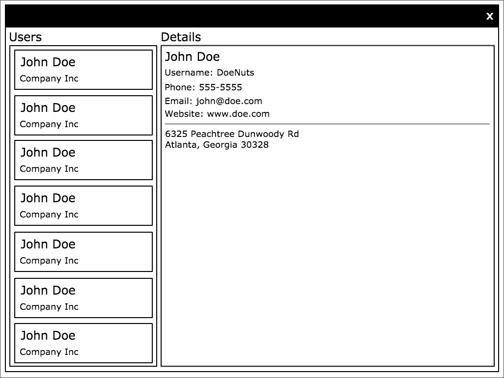

# User Depot

> Based on the original non-typescript [UserDepot](https://github.com/ksmithbaylor/user-depot)

Your mission (should you choose to accept it) is to call out to an API that returns a list of users, and display the information similar to this mockup.

The API is here: [https://jsonplaceholder.typicode.com/users](https://jsonplaceholder.typicode.com/users).

We've already included React, ReactDOM, and Axios (an easy-to-use API client), along with a few basic components for structure and layout. Feel free to change anything about what we've provided; it's completely up to you how you want to go about it.

To start a development server, just run `yarn start` (or `npm start`).

## Extra Credit

1. Sort the User List alphabetically by last name
2. Add a Loading Spinner to the User List at the appropriate time
